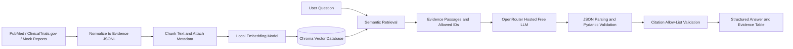

# LLM-Powered Translational Biomarker Assistant

A portfolio-ready retrieval-augmented generation (RAG) application that retrieves biomedical evidence and produces structured, citation-grounded translational research summaries.

The application demonstrates how large language models can support translational research by synthesizing evidence about biomarkers, mechanisms of action, clinical studies, treatment response, contradictory findings, and evidence quality.

The project uses OpenRouter’s hosted Free Models Router (`openrouter/free`). It does not require downloading a large language model or setting up OpenAI API billing. A free OpenRouter account and API key are required. Model availability, response speed, and request limits may vary depending on the free models available through OpenRouter.

> **Important:** The bundled `example_evidence.jsonl` records are synthetic and are provided only for software testing and portfolio demonstration. This application is not intended for clinical decision-making.

## Key Features

- Ingest biomedical evidence from JSONL files
- Collect public records from PubMed and ClinicalTrials.gov
- Generate local sentence-transformer embeddings
- Store embeddings and metadata in a persistent Chroma vector database
- Retrieve semantically relevant evidence for each user question
- Display retrieved passages in a transparent evidence table
- Generate structured answers using a hosted free LLM through an OpenAI-compatible API
- Validate model outputs with Pydantic schemas
- Retry generation when the returned JSON is invalid
- Apply citation allow-list guardrails to reduce unsupported references
- Report supporting evidence, contradictory findings, confidence, and limitations
- Evaluate retrieval quality, citation accuracy, and answer reliability
- Provide an interactive Streamlit user interface

## Application Workflow

1. Biomedical publications, clinical-trial records, pathway annotations, and mock reports are normalized into a common JSONL evidence format.
2. Documents are divided into searchable passages and enriched with metadata.
3. A local sentence-transformer model generates vector embeddings.
4. Embeddings and metadata are stored in Chroma.
5. The application retrieves the most relevant passages for a user question.
6. Retrieved evidence and allowed document identifiers are sent to a hosted LLM.
7. The generated answer is parsed and validated against a Pydantic schema.
8. Citation guardrails verify that cited document identifiers were included in the retrieved evidence.
9. The final answer and supporting evidence table are displayed in Streamlit.

## Architecture



## Project Scope

The bundled demonstration corpus focuses primarily on TIGIT plus PD-1/PD-L1 blockade in non-small cell lung cancer. The application framework is not limited to this topic. It can be extended to other biomarkers, therapies, mechanisms, and disease areas by adding or collecting additional evidence records and rebuilding the vector index.

Potential extensions include:

- ADC target and biomarker discovery
- Immunotherapy response and resistance
- ctDNA and minimal residual disease
- KRAS, EGFR, HER2, and other targeted therapies
- Single-cell and spatial biomarker evidence
- Multi-omics biomarker prioritization
- Clinical-trial landscape analysis

## Project Structure

```text
llm-biomarker-assistant/
├── app/
│   └── streamlit_app.py
├── data/
│   └── raw/
│       └── example_evidence.jsonl
├── eval/
│   ├── questions.jsonl
│   ├── evaluate_answers.py
│   └── evaluate_retrieval.py
├── scripts/
│   ├── check_openrouter.py
│   ├── fetch_clinicaltrials.py
│   └── fetch_pubmed.py
├── src/
│   ├── config.py
│   ├── embeddings.py
│   ├── generation.py
│   ├── guardrails.py
│   ├── ingest.py
│   ├── pipeline.py
│   ├── retrieval.py
│   └── schemas.py
├── tests/
├── .env.example
├── .gitignore
├── requirements.txt
└── README.md
```

## Installation

### 1. Clone the repository

```bash
git clone https://github.com/YOUR_USERNAME/llm-biomarker-assistant.git
cd llm-biomarker-assistant
```

Replace `YOUR_USERNAME` with your GitHub username.

### 2. Create and activate a virtual environment

Linux or macOS:

```bash
python -m venv .venv
source .venv/bin/activate
```

Windows PowerShell:

```powershell
python -m venv .venv
.venv\Scripts\Activate.ps1
```

### 3. Install dependencies

```bash
pip install -r requirements.txt
```

### 4. Configure environment variables

Copy the example configuration file:

```bash
cp .env.example .env
```

On Windows PowerShell:

```powershell
Copy-Item .env.example .env
```

Add your OpenRouter API key and NCBI contact email to `.env`:

```env
LLM_PROVIDER=openrouter
OPENROUTER_API_KEY=your_actual_openrouter_key
OPENROUTER_MODEL=openrouter/free
OPENROUTER_BASE_URL=https://openrouter.ai/api/v1

EMBEDDING_BACKEND=local
CHROMA_PATH=.chroma
COLLECTION_NAME=translational_evidence

NCBI_EMAIL=your_email@example.com
NCBI_API_KEY=
```

An NCBI API key is optional for small-scale testing. Do not commit `.env` to GitHub.

## Run the Application

Run all commands from the repository root.

### 1. Test the OpenRouter connection

```bash
python -m scripts.check_openrouter
```

### 2. Build the Chroma evidence index

```bash
python -m src.ingest
```

### 3. Start the Streamlit application

```bash
python -m streamlit run app/streamlit_app.py
```

Open the local address displayed in the terminal, normally:

```text
http://localhost:8501
```

## Example Questions

- What evidence supports combining a TIGIT inhibitor with anti-PD-1 therapy in NSCLC, and which biomarkers could identify responsive patients?
- What is the biological rationale for combining TIGIT and PD-1 blockade?
- Which biomarkers may predict response to TIGIT plus anti-PD-1 therapy?
- What contradictory or negative evidence exists for TIGIT combinations?
- How strong is the evidence for PD-L1 as a predictive biomarker?
- Could CD226-positive immune cells identify responsive patients?
- Which proposed biomarkers are clinically validated, and which remain hypothesis-generating?

To test the guardrails, ask a question that is not supported by the bundled evidence. The application should report insufficient evidence rather than inventing a conclusion.

## Build a Live Public Corpus

Collect PubMed records:

```bash
python scripts/fetch_pubmed.py \
  --query '(TIGIT) AND (NSCLC OR "non-small cell lung cancer")' \
  --output data/raw/pubmed_tigit_nsclc.jsonl
```

Collect ClinicalTrials.gov records:

```bash
python scripts/fetch_clinicaltrials.py \
  --query 'TIGIT AND NSCLC' \
  --output data/raw/clinicaltrials_tigit_nsclc.jsonl
```

After adding new evidence, rebuild the vector index:

```bash
python -m src.ingest
```

Before using public records for substantive research, add a curation step to:

- Classify study design and evidence level
- Extract biomarker endpoints and assay methods
- Normalize drug, target, gene, and disease names
- Link clinical trials to associated publications
- Remove duplicate records
- Preserve publication dates, trial update dates, and data cutoffs
- Distinguish peer-reviewed publications from conference abstracts

## Evaluation

Run retrieval evaluation:

```bash
python -m eval.evaluate_retrieval
```

Run answer-quality evaluation:

```bash
python -m eval.evaluate_answers
```

Run unit tests:

```bash
pytest -q
```

Suggested evaluation metrics include:

- Evidence recall@k
- Citation precision
- Unsupported-citation rate
- Contradictory-evidence coverage
- Confidence calibration
- Claim-to-citation entailment
- Structured-output success rate

## Guardrails

The application includes several safeguards:

- The LLM is instructed to use only retrieved evidence.
- Retrieved document identifiers form an allow-list for citations.
- Pydantic validates the expected answer structure.
- Invalid JSON responses trigger automatic repair retries.
- Answers include confidence and limitations fields.
- Contradictory evidence is reported explicitly.
- Unsupported questions should return an insufficient-evidence response.

These controls reduce unsupported claims but do not eliminate hallucinations. Human review remains necessary.

## Limitations

- The bundled corpus is small and synthetic.
- Free hosted models may have lower rate limits or temporary outages.
- OpenRouter may route different requests to different free models.
- Structured-output quality can vary across models.
- Retrieval quality depends on document coverage, chunking, metadata, and embedding quality.
- Citation validation confirms that a source was retrieved, but it does not by itself prove that the source fully supports every claim.
- The application is a research and portfolio demonstration, not a validated clinical or production system.
- OpenRouter receives prompts sent to its service. Do not submit protected health information, confidential internal reports, or proprietary data without an approved data-governance arrangement.

## Security and Data Privacy

- Keep API keys in `.env`.
- Ensure `.env`, `.chroma/`, and `.venv/` are excluded through `.gitignore`.
- Never commit credentials, patient-level data, or confidential company information.
- Use only public or synthetic data for a public GitHub demonstration.

## Future Improvements

- Hybrid dense and keyword retrieval
- Biomedical cross-encoder reranking
- Drug, target, biomarker, and disease entity normalization
- Claim-level citation entailment checks
- Trial-to-publication linking
- Section-aware document chunking
- Evidence deduplication and temporal tracking
- Human-curated evidence-quality scoring
- Expansion to ADC, ctDNA, immunotherapy, and multi-omics use cases
- Deployment through Streamlit Community Cloud or another hosted platform

## Disclaimer

This software is provided for educational, research, and portfolio purposes only. It is not intended to diagnose disease, recommend treatment, replace expert scientific review, or support clinical decision-making.
